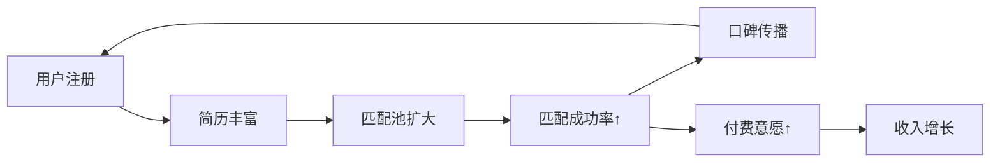
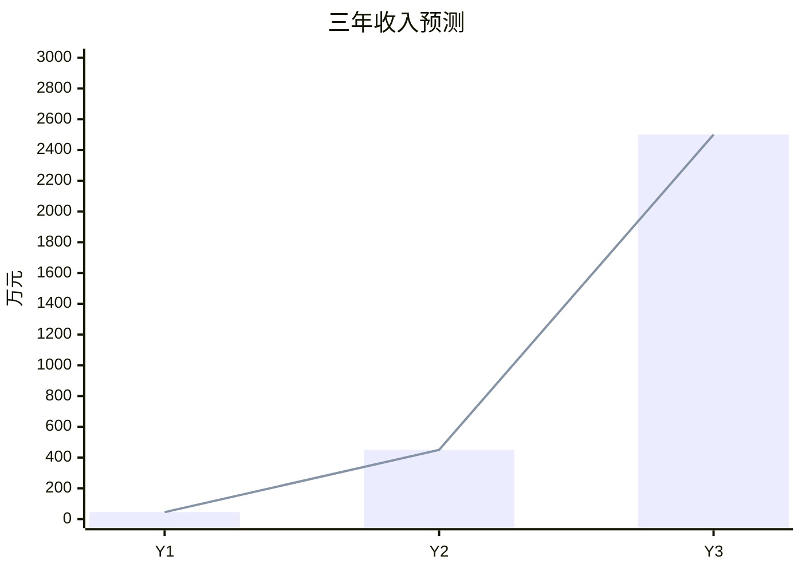

# Slidev 路演演示文稿生成 Skill（Slidev Pitch Deck Generator）

> **基础能力继承**：本 Skill 继承 `slidev-presentation` 通用 Skill 的全部能力（环境初始化、Slidev 语法、动画规则、视觉验证、配色方案、操作指引、演讲技巧、内容容错、可编辑 PPTX 补充路径等）。以下仅定义**投融资路演专属**的增强逻辑，与通用 Skill 冲突时以本 Skill 为准。

## 适用场景

当用户需要以下操作时，触发此 Skill：
- 将投研报告 / 商业计划书 / BP 文档转换为路演演示文稿
- 创建面向 VC / 投资人的 pitch deck
- 生成可投屏、可导出 PDF/PPTX 的路演材料
- 用户说"做个路演 PPT"、"生成 pitch deck"、"BP 转幻灯片"等

---

## 一、源文档定位（覆盖通用 Step 1）

1. 检查用户是否指定了 Markdown 源文件路径
2. 如未指定，在项目 `docs/` 目录下搜索 `*BP*`、`*投研*`、`*商业计划*`、`*pitch*` 等关键词匹配的 `.md` 文件
3. 如果找不到源文档，提示用户先使用「投研报告生成 Skill」（`investment-research-report`）生成 BP 文档
4. 读取并解析源文档内容

---

## 二、投融资路演专属 Frontmatter（覆盖通用 2.1）

```yaml
---
theme: default
title: '{项目名} — 投资路演'
info: |
  {项目一句话定位}
  面向 VC / 投资人的融资路演材料
author: '{团队/公司名}'
keywords: '{项目名},投资,路演,商业计划书'
exportFilename: '{项目名}-pitch-deck'
drawings:
  persist: false
transition: slide-left
mdc: true
---
```

---

## 三、投研报告模块 → 幻灯片映射（覆盖通用 2.2）

按照以下映射关系，将投研报告的 10 个模块转换为幻灯片：

| 源模块 | Slidev 布局 | 幻灯片数 | 转换规则 |
|--------|------------|---------|---------|
| 封面/标题 | `layout: cover` | 1 | 项目名 + 一句话定位 + 融资金额 |
| 执行摘要 - 核心亮点 | `layout: default` + `v-clicks` | 1 | 3-5 个亮点用 v-clicks 逐条显示 |
| 执行摘要 - 里程碑 | `layout: two-cols` | 1 | 左：已完成，右：未来目标 |
| 市场分析 - 宏观数据 | `layout: fact` | 1 | 选最震撼的 1-2 个数据做大字展示 |
| 市场分析 - TAM/SAM/SOM | `layout: default` | **2（必须拆页）** | 一页：嵌套圆可视化（独占）；另一页：规模拆解表格 + 关键洞察（禁止圆+表格同页，高度必溢出） |
| 行业痛点 | `layout: default` + `v-clicks` | 1-3 | 每个痛点一页，或合并为一页逐条显示 |
| 产品方案 | `layout: image-right` 或 `default` | 1-2 | 核心功能矩阵表 + 产品截图（如有） |
| 商业模式 | `layout: default` | 1-2 | 收入模型表 + 单位经济模型 |
| 竞品分析 | `layout: default` | 1 | 竞品矩阵表 |
| 增长策略 | `layout: default` | 1 | 增长飞轮图（Mermaid flowchart） |
| 财务预测 | `layout: default` | **2（必须拆页）** | 一页：三年预测表格；另一页：趋势图表（禁止同页，防溢出） |
| 团队介绍 | `layout: default` 或 `image-left` | 1 | 团队成员信息 |
| 融资计划 | `layout: center` | 1 | 融资金额 + 资金用途 + 下一步 |
| 愿景/结束页 | `layout: end` 或 `center` | 1 | 愿景语句 + 联系方式 |

**总计控制在 13-18 页**，路演黄金时长 15-20 分钟。

---

## 四、投融资专属图表模板

### 4.1 TAM/SAM/SOM 嵌套圆（纯 CSS 实现）

> ⚠️ **嵌套圆必须独占一页**，禁止在同一页添加表格。圆形容器 300-420px + 标签偏移 ~24px，加上 h1 和 padding 已接近 620px 可用高度上限。表格应放在下一页。

**第一页：嵌套圆可视化**
```html
<!-- 容器高度 420px，加 h1(50px) + padding(80px) = 550px，安全 -->
<div class="flex justify-center items-center" style="height: 420px;">
  <div class="relative">
    <div class="tam-circle">
      <span class="absolute -top-6 text-sm font-bold" style="color: #93c5fd;">TAM: {数值}</span>
      <div class="sam-circle">
        <span class="absolute -top-5 text-sm font-bold" style="color: #93c5fd;">SAM: {数值}</span>
        <div class="som-circle">
          <span class="text-xs text-center leading-tight">SOM<br/>{数值}<br/>(Y1)</span>
        </div>
      </div>
    </div>
  </div>
</div>
```

**第二页：市场规模拆解表格**
```markdown
| 层级 | 规模 | 计算逻辑 |
|------|------|---------|
| **TAM** | {数值} | {来源} |
| **SAM** | {数值} | {渗透率逻辑} |
| **SOM** | {数值} | {用户×付费率×ARPU} |

<!-- 可在表格下方添加关键洞察卡片 -->
```

### 4.2 增长飞轮（Mermaid）
```markdown


### 4.3 财务预测趋势（Mermaid xychart）
```markdown


### 4.4 大数据展示（layout: fact）
```markdown
---
layout: fact
---

# 93.8亿元
互联网婚恋交友市场规模（2023）

<div class="text-sm opacity-60 mt-4">数据来源：艾媒咨询《2024-2025年中国婚恋社交服务市场研究报告》</div>
```

---

## 五、投资人风格样式（覆盖通用 2.6）

在 `slidev-deck/style.css` 中使用投资人审美偏好的样式：

```css
/* 投资人路演风格 */
:root {
  --slidev-theme-primary: #1a365d;
  --slidev-theme-cover-bg: linear-gradient(135deg, #1a365d 0%, #2d3748 100%);
}

/* 大数据展示样式 */
.fact-number {
  font-size: 4rem;
  font-weight: 800;
  background: linear-gradient(135deg, #2563eb, #7c3aed);
  -webkit-background-clip: text;
  -webkit-text-fill-color: transparent;
}

/* ⚠️ 表格 — 深色主题安全配色（参见通用 Skill 2.9 节） */
table {
  font-size: 0.85em;
  width: 100%;
  border-collapse: collapse;
}
table th {
  background: #2563eb;
  color: #ffffff;
  font-weight: 600;
  padding: 10px 14px;
  border-bottom: 2px solid #1d4ed8;
}
table td {
  padding: 8px 14px;
  color: #e2e8f0;
}
table tr:nth-child(odd) td {
  background: rgba(30, 58, 95, 0.6);
  color: #f1f5f9;
}
table tr:nth-child(even) td {
  background: rgba(45, 80, 130, 0.4);
  color: #f1f5f9;
}

/* 强调文字 — 深色主题安全 */
strong { color: #60a5fa; }

/* 封面样式 */
.slidev-layout.cover {
  background: linear-gradient(135deg, #1a365d 0%, #2d3748 100%);
  color: white;
}

/* Mermaid 自适应 + 溢出保护 + 响应式（参见通用 Skill 2.10 节） */
.mermaid { display: flex; justify-content: center; overflow: visible; }
.mermaid svg { max-width: 100%; height: auto; }
.slidev-layout { overflow: hidden; }
@media (max-width: 900px) {
  table { font-size: 0.75em; }
  table th, table td { padding: 5px 8px; }
}
```

---

## 六、路演叙事逻辑（覆盖通用 5.1）

投融资路演必须遵循以下叙事结构：

```
痛点（为什么需要）→ 方案（我们怎么做）→ 市场（有多大空间）→ 模式（怎么赚钱）→ 竞争（为什么是我们）→ 数据（做得怎么样）→ 团队（谁在做）→ 融资（需要什么）
```

---

## 七、投融资专属内容容错（补充通用 5.4）

| 缺失内容 | 降级策略 |
|---------|---------|
| 无 TAM/SAM/SOM 数据 | 跳过嵌套圆，用行业增长趋势替代 |
| 无财务预测具体数字 | 使用定性描述 + "详见附件" |
| 无团队详细信息 | 用核心团队一句话介绍替代整页 |
| 无竞品数据 | 用差异化优势列表替代竞品矩阵表 |
| 源文档 < 5 个模块 | 将总页数压缩至 8-12 页 |

---

## 八、路演时间分配（覆盖通用 6.1）

15-20 分钟路演的推荐时间分配：

| 模块 | 时间占比 | 建议时长（15min） |
|------|---------|-----------------|
| 开场 Hook + 痛点 | 15% | 2-2.5 min |
| 产品方案 | 20% | 3 min |
| 市场分析 | 15% | 2-2.5 min |
| 商业模式 | 15% | 2-2.5 min |
| 数据/竞品 | 15% | 2-2.5 min |
| 团队 + 融资 | 10% | 1.5 min |
| 愿景收尾 | 5% | 45 sec |
| 预留缓冲 | 5% | 45 sec |

**路演练习检查点**（以 15 分钟为例）：
- 第 3 分钟 → 应完成痛点+方案
- 第 7 分钟 → 应完成市场+模式（进入下半场）
- 第 12 分钟 → 应开始团队/融资
- **应急策略**：如果发现超时，跳过竞品细节页，直接到融资页（永远不要跳过结尾）

---

## 九、与投研报告 Skill 的联动

此 Skill 与 `investment-research-report` Skill 互补：

| 步骤 | Skill | 产物 |
|------|-------|------|
| 1. 生成投研报告 | `investment-research-report` | `docs/xxx-投研报告-BP.md` |
| 2. 生成路演演示文稿 | `slidev-pitch-deck`（本 Skill） | `slidev-deck/slides.md` → PDF/HTML |
| 3. 生成可编辑 PPTX | 直接在 AI IDE 中用 python-pptx 或其他工具 | `docs/slides-output/*.pptx` |

如果用户同时需要可编辑的 PPTX 和交互式演示文稿，应建议：
- **路演投屏 / 发链接**：用 Slidev（本 Skill 产物）
- **发邮件附件 / 尽职调查**：用 `docs/slides-output/` 下的 PPTX

---

## 十、Quality Checklist（投融资专属，补充通用八章）

在通用 Checklist 基础上，额外检查：

**投融资内容专项**：
- [ ] 总页数在 13-18 页之间
- [ ] 封面包含项目名、定位、融资信息
- [ ] 叙事遵循第六章路演逻辑
- [ ] TAM/SAM/SOM 嵌套圆独占一页 + 规模拆解表格独占另一页（禁止同页）
- [ ] 财务预测表格和趋势图表分别独占一页（禁止同页）
- [ ] 竞品矩阵以表格呈现
- [ ] 财务预测有图表（Mermaid xychart 或表格）
- [ ] 增长飞轮有 Mermaid 流程图
- [ ] 关键数据用 `layout: fact` 或大字样式突出
- [ ] 末尾有联系方式和愿景
- [ ] 演讲者笔记已添加到关键页面

**Playwright MCP 视觉验证（继承通用 Skill 3.0 节）**：
- [ ] 已通过 Playwright MCP 逐页截图 review 全部页面
- [ ] `two-cols` 里程碑页左右栏内容均完整（使用 3.2 节正确语法）
- [ ] 商业模式页底部 v-click 内容未被截断（`mt-2` 而非 `mt-4`）
- [ ] 所有 `bg-*` 工具类已替换为 `rgba()` 内联样式（深色主题安全）