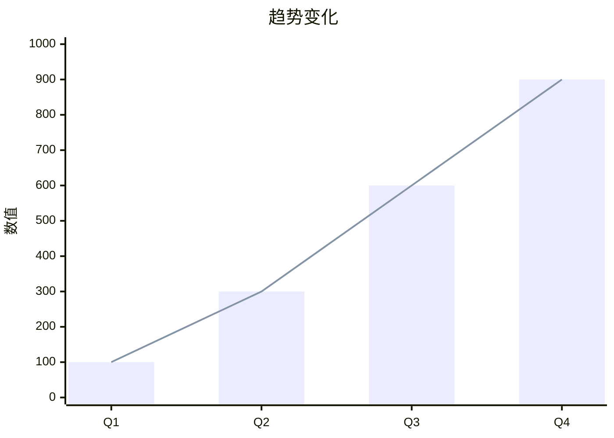
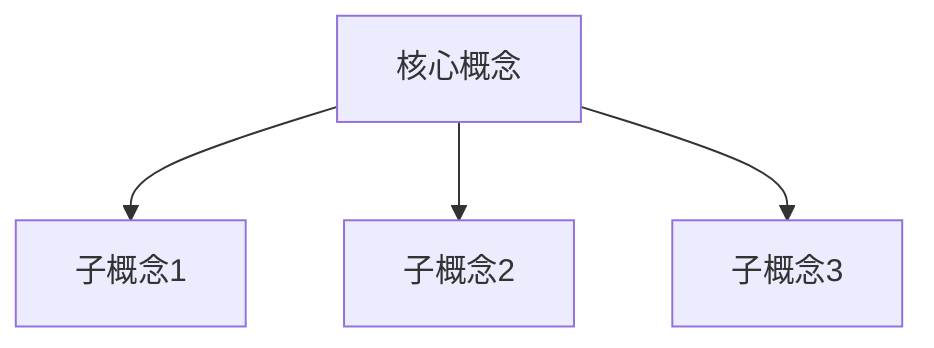

# Slidev 演示文稿通用生成 Skill（Slidev Presentation Generator）

## 适用场景

当用户需要以下操作时，触发此 Skill：
- 将 Markdown 文档转换为交互式演示文稿
- 创建 Slidev 格式的幻灯片
- 生成可投屏、可导出 PDF/PPTX 的演示材料
- 用户说"做个 PPT"、"生成幻灯片"、"转成演示文稿"等

> **注意**：如果用户明确需要"投融资路演"、"BP 演示"、"pitch deck"，应优先使用 `slidev-pitch-deck` Skill（继承本 Skill 的通用能力 + 叠加投融资专属逻辑）。

---

## 一、Skill 工作流程

### Step 1：定位源文档

1. 检查用户是否指定了 Markdown 源文件路径
2. 如未指定，在项目 `docs/` 目录下搜索用户提到的关键词匹配的 `.md` 文件
3. 如果找不到源文档，提示用户提供 Markdown 文件或直接输入内容
4. 读取并解析源文档内容

### Step 2：环境检查与初始化

在项目根目录下创建 `slidev-deck/` 工作目录（如已存在则复用），检查是否已有 `package.json`：

**如果是首次使用**，生成以下文件：

#### `slidev-deck/package.json`
```json
{
  "name": "presentation",
  "private": true,
  "scripts": {
    "dev": "slidev",
    "build": "slidev build",
    "export-pdf": "slidev export",
    "export-pptx": "slidev export --format pptx"
  },
  "dependencies": {
    "@slidev/cli": "^51.0.0",
    "@slidev/theme-default": "latest"
  }
}
```

然后提示用户执行：
```bash
cd slidev-deck && npm install
```

**如果已有环境**，直接进入 Step 3。

### Step 3：解析源文档并生成 Slidev Markdown

将源文档 Markdown 转换为 Slidev 格式的 `slidev-deck/slides.md`。

---

## 二、Slidev Markdown 转换规则

### 2.1 全局 Frontmatter（文件头部）

```yaml
---
theme: default
title: '{演示文稿标题}'
info: |
  {演示文稿简介}
author: '{作者/团队名}'
keywords: '{关键词}'
exportFilename: '{导出文件名}'
drawings:
  persist: false
transition: slide-left
mdc: true
---
```

### 2.2 通用布局映射规则

根据内容语义选择合适的 Slidev 布局：

| 内容类型 | Slidev 布局 | 使用场景 |
|---------|------------|---------|
| 封面/标题 | `layout: cover` | 第一页，标题 + 副标题 + 作者 |
| 纯文字要点 | `layout: default` + `v-clicks` | 列表、要点、步骤 |
| 左右对比 | `layout: two-cols` | A vs B、现状 vs 方案、左文右图 |
| 单个核心数据 | `layout: fact` | 大数字 + 注释说明 |
| 带图片 | `layout: image-right` 或 `image-left` | 产品截图、架构图配文字 |
| 居中强调 | `layout: center` | 重要引言、关键结论 |
| 结束页 | `layout: end` 或 `center` | 致谢 + 联系方式 |
| 章节分隔 | `layout: section` | 模块间过渡页 |

**总页数建议控制在 10-25 页**，根据内容量和演示时长调整。

### 2.3 幻灯片分页语法

每页之间用 `---` 分隔，每页可添加页级 frontmatter：

```markdown
---
layout: cover
background: ''
class: text-center
---

# 演示标题

副标题说明

---
layout: default
transition: fade-out
---

# 要点列表

<v-clicks>

- 要点一
- 要点二
- 要点三

</v-clicks>
```

### 2.4 动画规则

| 场景 | 语法 | 说明 |
|------|------|------|
| 列表逐条显示 | `<v-clicks>` 包裹列表 | 最常用，控制演讲节奏 |
| 表格逐行显示 | 每行用 `<v-click>` 包裹 | 适合数据对比 |
| 重点数据突出 | `<span v-mark.red="1">` | 圈注关键数据 |
| 幻灯片过渡 | `transition: slide-left` | 全局默认，可按页覆盖 |

### 2.5 图表增强规则

当源文档中包含结构化数据时，自动转为可视化图表：

#### 流程图（Mermaid）
```markdown


#### 趋势图（Mermaid xychart）
```markdown


#### 关系图（Mermaid）
```markdown


### 2.6 基础样式模板

在 `slidev-deck/` 下创建 `style.css`：

```css
/* 通用演示文稿样式 */
:root {
  --slidev-theme-primary: #1a365d;
  --slidev-theme-cover-bg: linear-gradient(135deg, #1a365d 0%, #2d3748 100%);
}

/* 大数据展示样式 */
.fact-number {
  font-size: 4rem;
  font-weight: 800;
  background: linear-gradient(135deg, #2563eb, #7c3aed);
  -webkit-background-clip: text;
  -webkit-text-fill-color: transparent;
}

/* ⚠️ 表格优化 — 深色主题安全配色
   Slidev 默认深色主题下文字为白色，表格背景色必须同步设置 td 文字色，
   否则浅色背景 + 白色文字 = 不可见。使用 rgba 半透明背景确保深/浅色模式均可读。 */
table {
  font-size: 0.85em;
  width: 100%;
  border-collapse: collapse;
}
table th {
  background: #2563eb;
  color: #ffffff;
  font-weight: 600;
  padding: 10px 14px;
  border-bottom: 2px solid #1d4ed8;
}
table td {
  padding: 8px 14px;
  color: #e2e8f0;
}
table tr:nth-child(odd) td {
  background: rgba(30, 58, 95, 0.6);
  color: #f1f5f9;
}
table tr:nth-child(even) td {
  background: rgba(45, 80, 130, 0.4);
  color: #f1f5f9;
}

/* 强调文字 — 深色主题下使用亮色而非深色 */
strong {
  color: #60a5fa;
}

/* 封面样式 */
.slidev-layout.cover {
  background: linear-gradient(135deg, #1a365d 0%, #2d3748 100%);
  color: white;
}

/* Mermaid 图表自适应 */
.mermaid {
  display: flex;
  justify-content: center;
  overflow: visible;
}
.mermaid svg {
  max-width: 100%;
  height: auto;
}

/* 全局幻灯片内容溢出保护 */
.slidev-layout {
  overflow: hidden;
}

/* 响应式适配 — 小视口 / 窗口缩小 */
@media (max-width: 900px) {
  table { font-size: 0.75em; }
  table th, table td { padding: 5px 8px; }
  .slidev-layout.cover h1 { font-size: 2rem; }
  .slidev-layout.fact h1 { font-size: 3rem; }
}
@media (max-width: 640px) {
  table { font-size: 0.65em; }
  table th, table td { padding: 4px 6px; }
  h1 { font-size: 1.5rem !important; }
}
```

### 2.7 演讲者笔记

每页底部添加演讲者笔记（用 HTML 注释语法）：

```markdown
<!--
这页的关键信息：
- 要点 1
- 要点 2
- 预估讲述时间：2 分钟
-->
```

### 2.8 多主题配色方案（按行业/受众选择）

生成前，根据项目所属行业和目标受众选择合适的配色方案，修改 `style.css` 中的 CSS 变量：

| 方案名 | 适用场景 | 主色 | 辅色 | 强调色 |
|-------|---------|------|------|-------|
| **经典深蓝**（默认） | 金融/企业级 | `#1a365d` | `#2d3748` | `#2563eb` |
| **科技紫** | AI/SaaS/深科技 | `#3D2F68` | `#181B24` | `#B165FB` |
| **翡翠绿** | 健康/教育/社会企业 | `#40695B` | `#FFE1C7` | `#FCFCFC` |
| **珊瑚暖** | 消费品/社交/生活方式 | `#5EA8A7` | `#277884` | `#FE4447` |
| **黑金** | 奢侈品/高端 | `#000000` | `#1C2833` | `#BF9A4A` |
| **活力橙** | 创业早期/年轻受众 | `#F96D00` | `#222831` | `#F2F2F2` |

**配色应用规则**：
- 封面背景使用主色渐变
- 标题使用主色，正文使用 `#2d3748`（深灰）
- 表头使用主色背景 + 白字
- 数据高亮使用强调色
- `layout: fact` 的大数字使用强调色渐变

```css
/* 示例：科技紫主题 */
:root {
  --slidev-theme-primary: #3D2F68;
  --slidev-theme-cover-bg: linear-gradient(135deg, #3D2F68 0%, #181B24 100%);
}
.fact-number {
  background: linear-gradient(135deg, #B165FB, #7C3AED);
  -webkit-background-clip: text;
  -webkit-text-fill-color: transparent;
}
table th { background: #3D2F68; color: white; }
```

### 2.9 深色主题配色安全规则（防踩坑）

Slidev 默认主题在深色模式下，页面背景为深色（`#1a2332` 左右），文字默认白色。以下是**必须遵守的配色安全规则**：

#### ⚠️ 已知踩坑场景与防护措施

| 踩坑场景 | 根因 | 防护规则 |
|---------|------|---------|
| 表格偶数行白底 + 白字 | `tr:nth-child(even)` 设了浅色背景但没设 `td` 文字色 | **表格行必须同时设置 `background` 和 `color`**，使用 `rgba` 半透明背景 |
| `strong` 加粗文字深色不可见 | `strong { color: #1a365d }` 在深色背景下对比度不足 | **强调色使用亮色系**（如 `#60a5fa`），禁用深色值 |
| `bg-blue-50` 等 UnoCSS 工具类 | 浅色背景 class 在深色主题下文字不可见 | **自定义覆盖工具类**，使用 `rgba` + 明确设置 `color` |
| TAM/SAM/SOM 标签文字 | 内联 `style="color: #1a365d"` 在深色背景不可见 | **标签文字统一用亮色**（`#93c5fd`） |

#### 配色安全自检公式

对任意「背景色 + 文字色」组合，检查 WCAG 2.0 对比度 ≥ 4.5:1：
- 深色背景（`#1a2332`）→ 文字用 `#e2e8f0` / `#f1f5f9` / `white`
- 亮色背景（`#f7fafc`）→ 文字用 `#1e293b` / `#334155`
- **永远不要只设背景不设文字色**

### 2.10 响应式适配与内容溢出防护

#### ⚠️ 核心原则：一页只做一件事

Slidev 默认幻灯片可视区域为 **960×700px**，扣除 padding 后内容区可用高度约 **620px**。任何超出此高度的内容都会被 `overflow: hidden` 截断，用户看不到。

**强制拆页规则（生成阶段必须遵守）**：

| 禁止同页的组合 | 原因 | 正确做法 |
|---------------|------|---------|
| 可视化图形 + 数据表格 | 图形（嵌套圆/TAM圆/自定义CSS图）通常 300-420px，表格 3+ 行需 150px+，合计超 620px | **拆为两页**：一页图形，一页表格 |
| Mermaid 图表 + 数据表格 | xychart 类图表 ~350px，加表格必溢出 | **拆为两页** |
| Mermaid 图表 + 多个卡片 | 卡片组（grid）高度不可控 | 图表独占一页，底部最多加一行文字摘要 |
| 表格 + v-click 展开内容 | v-click 展开后高度增加，可能溢出 | 确保表格 ≤ 4 行时才允许底部加 v-click |
| 列表 > 6 项 | 底部 bullet 被截断 | 拆为两页或删减至 6 项以内 |

#### 内容高度预估公式（生成阶段必做）

在 slides.md 生成**每一页**时，必须做高度预估：

```
h1 标题:            ~50px
h3 子标题:          ~36px
表格每行:           ~40px（含 th/td padding）
表格表头:           ~44px
列表每条 bullet:    ~28px
Mermaid graph LR:   ~200px（简单流程图）
Mermaid xychart:    ~350px（柱状图/折线图）
CSS 嵌套圆（TAM）:  300-420px（取决于容器设置）
v-click 展开内容:    按内容实际高度计算
一行文字/说明:      ~24px
div 卡片（p-3/p-4）: ~60-80px 每个
grid 卡片组:        单行 ~80px
代码块:             ~24px × 行数 + 40px（padding）
间距（mt-4/mt-6）:  16px / 24px

总预算 = 620px（可用高度）
如果预估总高度 > 550px → 高风险，必须拆页或精简
```

**每页生成后，在注释中标注预估高度**，例如：
```html
<!--
内容高度预估：h1(50) + 表格(44+40×5) + 文字(24) = 314px ✅ 安全
-->
```

#### style.css 必须包含的响应式规则

```css
/* Mermaid 图表自适应（必须） */
.mermaid { display: flex; justify-content: center; overflow: visible; }
.mermaid svg { max-width: 100%; height: auto; }

/* 全局溢出保护（必须） */
.slidev-layout { overflow: hidden; }

/* 响应式媒体查询（推荐） */
@media (max-width: 900px) {
  table { font-size: 0.75em; }
  table th, table td { padding: 5px 8px; }
}
@media (max-width: 640px) {
  table { font-size: 0.65em; }
  h1 { font-size: 1.5rem !important; }
}
```

---

## 三、视觉验证与质量保证

### 3.0 Playwright MCP 自动化视觉验证（推荐方案）

> **核心能力**：通过 `@playwright/mcp` 工具，AI 可以直接导航到 Slidev 页面、截图、执行 JS 检测溢出，实现**真正的视觉闭环验证**，不再依赖用户人工检查。

#### 前置条件

确保 MCP 配置中已添加 Playwright MCP Server（全局配置 `~/.codebuddy/mcp.json`）：

```json
{
  "mcpServers": {
    "playwright": {
      "command": "npx",
      "args": ["@playwright/mcp@latest"],
      "timeout": 60000,
      "disabled": false
    }
  }
}
```

#### Step V1：启动 Slidev Dev Server

```bash
cd slidev-deck && npm run dev
# 默认端口 http://localhost:3030
```

如果端口被占用，先确认已有 Slidev 进程：`curl -s -o /dev/null -w "%{http_code}" http://localhost:3030/1` 返回 200 即可。

#### Step V2：Playwright MCP 逐页截图 Review

使用 Playwright MCP 工具逐页导航 + 截图，关键要点：

1. **导航时使用 `?clicks=99` 参数**展开所有 `<v-clicks>` 动画内容，否则只能看到动画前的静态状态：
   ```
   browser_navigate → http://localhost:3030/{页码}?clicks=99
   browser_take_screenshot → slide-{页码}.png
   ```

2. **逐页检查清单**（对每张截图分析）：

| 检查项 | 判定标准 | 常见问题 |
|--------|---------|---------|
| **文本溢出** | 所有文字完整显示在可视区域内 | bullet 过多导致底部被截断 |
| **元素重叠** | 文字、图表、装饰元素无遮挡 | Mermaid 图表与标题重叠 |
| **对比度** | 文字在背景上清晰可读 | 浅色文字在浅色背景上 |
| **内容密度** | 符合 5.2 节密度控制标准 | 单页超过 6 个 bullet |
| **图表渲染** | Mermaid / CSS 图表正确显示 | 语法错误导致空白 |
| **布局完整** | 所有 slot 内容均正确渲染 | `two-cols` 布局左栏缺失 |

3. **截图后立即清理临时文件**：`rm -f slide-*.png`

#### Step V3：JS 精确检测溢出（可选，补充截图验证）

通过 `browser_evaluate` 执行 JS 代码检测 DOM 级别的溢出：

```javascript
// 在当前页执行
() => {
  const slide = document.querySelector('.slidev-page-current') ||
    Array.from(document.querySelectorAll('.slidev-page'))
      .find(s => getComputedStyle(s).display !== 'none');
  if (!slide) return { error: 'no slide found' };
  const layout = slide.querySelector('[class*=slidev-layout]');
  return {
    scrollH: layout.scrollHeight,
    clientH: layout.clientHeight,
    overflow: layout.scrollHeight > layout.clientHeight
  };
}
```

> **注意**：Slidev SPA 模式下非当前页的 DOM 尺寸为 0（虚拟滚动），JS 检测只能验证当前导航到的页面。因此**截图验证是主要手段**，JS 检测是辅助。

#### Step V4：发现问题 → 修改 → HMR 自动刷新 → 重新截图验证

```
Playwright 截图发现问题
    ↓
定位到 slides.md 中的具体页面
    ↓
修改 Markdown 内容（Slidev HMR 自动刷新）
    ↓
等待 2-3 秒后重新导航 + 截图
    ↓
确认问题已修复
```

#### Step V5：清理截图文件

验证完成后必须删除所有临时截图文件：
```bash
rm -f slide-*.png
```

### 3.1 已验证的常见问题与修复经验

以下是通过 Playwright MCP 实际验证发现的高频问题及其修复方案：

| 问题 | 根因 | 修复方案 |
|------|------|---------|
| **`two-cols` 布局左栏内容缺失** | 同时使用 default slot 和 `::left::` slot 导致冲突 | 移除 `::left::` 声明，将左侧内容直接放在 `::right::` 之前作为 default slot |
| **`bg-blue-50` 等浅色背景在深色主题下不可见** | UnoCSS 工具类只设背景不设文字色 | 改用 `style="background: rgba(37,99,235,0.12);"` 内联样式 |
| **底部 v-click 内容被截断** | 表格 + v-click 展开内容总高度超过 620px | 减少 `mt-4` 为 `mt-2`，或将 v-click 内容简化为一行 |
| **v-clicks 页面看起来空白** | 截图时未展开动画内容 | 导航时加 `?clicks=99` 参数 |

### 3.2 `two-cols` 布局正确语法（经验证）

```markdown
---
layout: two-cols
---

# 页面标题

### 左侧小标题
- 左侧内容 1
- 左侧内容 2

::right::

### 右侧小标题
- 右侧内容 1
- 右侧内容 2
```

**关键规则**：
- `# 标题` + 左侧内容放在 `::right::` 之前（作为 default slot → 渲染到左列）
- **不要**同时使用 `::left::` 和 default slot，否则会导致内容丢失
- 只用 `::right::` 声明右列内容即可

### 3.3 无 Playwright MCP 时的降级方案

如果环境不支持 Playwright MCP，仍可使用以下方式：

1. **代码级 review**：逐页分析 slides.md 中每页的元素组成，用 2.10 节公式计算总高度
2. **坦诚告知用户**：说明 AI 只能做代码层面分析，建议用户自行通过浏览器检查
3. **Checklist 驱动**：依赖第八章 Quality Checklist 的结构化检查项

---

## 四、生成后的操作指引

### 4.1 文件结构

生成完成后，`slidev-deck/` 目录应包含：

```
slidev-deck/
├── package.json          # 依赖配置
├── slides.md             # 主幻灯片文件（核心产物）
└── style.css             # 自定义样式（可选）
```

### 4.2 告知用户的操作命令

生成完成后，必须告诉用户以下命令：

```bash
# 1. 安装依赖（仅首次）
cd slidev-deck && npm install

# 2. 启动开发服务器（实时预览）
npm run dev
# 浏览器打开 http://localhost:3030

# 3. 导出 PDF（用于发送/归档）
npm run export-pdf
# 产出：slidev-deck/dist/{导出文件名}.pdf

# 4. 导出 PPTX（注意：文本为图片，不可编辑）
npm run export-pptx
# 产出：slidev-deck/dist/{导出文件名}.pptx

# 5. 构建静态站（可部署到任意静态服务）
npm run build
# 产出：slidev-deck/dist/ 目录
```

### 4.3 演示技巧提示

告知用户：
- 按 `F` 进入全屏模式（投屏演示）
- 按 `P` 进入演讲者模式（显示笔记、计时器、下一页预览）
- 方向键 / 空格翻页
- 按 `O` 进入幻灯片总览模式
- 按 `D` 切换暗色/亮色模式

---

## 五、内容编排原则

### 5.1 通用叙事逻辑

根据演示目的选择合适的叙事结构：

| 演示类型 | 推荐叙事结构 |
|---------|-------------|
| **技术分享** | 背景 → 问题 → 方案 → 实现 → Demo → 总结 |
| **产品介绍** | 痛点 → 方案 → 功能 → 优势 → 案例 → 行动号召 |
| **培训课件** | 目标 → 概念 → 示例 → 练习 → 总结 → Q&A |
| **学术汇报** | 研究背景 → 研究问题 → 方法 → 结果 → 讨论 → 结论 |
| **投融资路演** | 痛点 → 方案 → 市场 → 模式 → 竞争 → 数据 → 团队 → 融资（详见 `slidev-pitch-deck` Skill）|

### 5.2 每页内容密度控制

| 类型 | 内容上限 | 说明 |
|------|---------|------|
| 文字页 | ≤ 6 个 bullet point | 多了观众记不住 |
| 数据页 | ≤ 1 个核心数据 + 支撑 | 大数字 + 小字注释 |
| 表格页 | ≤ 6 行 × 5 列 | 太大就拆成多页 |
| 图表页 | ≤ 1 个图表 + 标题 | 让图表说话 |

### 5.3 大数据展示模式

对于需要强调的核心数据，使用「大字+注释」模式：

```markdown
---
layout: fact
---

# 核心数据

数据说明与注释

<div class="text-sm opacity-60 mt-4">数据来源：xxx</div>
```

### 5.4 内容容错与优雅降级

当源文档数据不完整或某些模块缺失时，按以下规则降级处理：

| 缺失情况 | 降级策略 |
|---------|---------|
| 无具体数字 | 使用定性描述 + "详见附件" |
| 源文档模块不足 | 减少总页数，确保有的内容做精 |
| Mermaid 图表渲染失败 | 降级为 HTML 表格或有序列表 |
| 内容超密度限制 | 自动拆分为多页（优先级：表格 > 列表 > 段落） |
| 缺少图片资源 | 用 CSS 装饰元素或 Mermaid 图替代 |

---

## 六、演讲准备指导

### 6.1 时间分配参考

| 演示时长 | 建议页数 | 每页平均时间 |
|---------|---------|-------------|
| 5 分钟 | 6-8 页 | 40-50 秒 |
| 10 分钟 | 10-14 页 | 45-60 秒 |
| 15 分钟 | 13-18 页 | 50-70 秒 |
| 20 分钟 | 16-22 页 | 55-75 秒 |
| 30 分钟 | 20-30 页 | 60-90 秒 |

### 6.2 练习与计时建议

告知用户以下练习建议：

- **至少练习 3 遍**，前 2 遍会超时，第 3 遍才能精准卡时
- **设置中间检查点**：在演示 1/3 和 2/3 处标记时间检查点
- **应急策略**：如果发现超时，跳过细节页，直接到结论页（永远不要跳过结尾）
- **利用 Slidev 演讲者模式**（按 `P`）：显示当前时间、演讲者笔记、下一页预览

---

## 七、可编辑 PPTX 补充说明

Slidev 导出的 PPTX 是截图形式（文本不可编辑），如果用户需要原生可编辑的 PPTX，有以下补充路径可建议：

| 方案 | 工具 | 优点 | 缺点 |
|------|------|------|------|
| PptxGenJS | `npm install pptxgenjs` | 原生可编辑文本/图表，支持 10 种图表类型 | 需要写 JS 代码生成 |
| python-pptx | `pip install python-pptx` | Python 生态，模板替换成熟 | 图表能力较弱 |
| html2pptx | HTML → Playwright → PptxGenJS | 设计灵活度高，可视化 | 依赖链较重 |

建议的双引擎工作流：
1. **演示现场** → Slidev（交互动画 + 演讲者模式 + 实时预览）
2. **材料分发** → PptxGenJS 或 python-pptx 生成可编辑 PPTX

---

## 八、Quality Checklist

生成完成后，自检以下项目：

**结构与格式**：
- [ ] slides.md 可被 Slidev 正确解析（frontmatter 格式正确、分页符 `---` 无缺失）
- [ ] 总页数在合理范围内（参考 6.1 时间分配表）
- [ ] 封面包含标题、副标题
- [ ] package.json 依赖版本正确
- [ ] 用户操作指引完整（安装、预览、导出命令）

**内容质量**：
- [ ] 每页内容不超密度限制（5.2 节标准）
- [ ] 关键数据用 `layout: fact` 或大字样式突出
- [ ] 列表使用 `<v-clicks>` 动画
- [ ] 数据/图表页与文字页交替出现
- [ ] 末尾有总结/致谢/联系方式
- [ ] 演讲者笔记已添加到关键页面

**视觉验证**（第三章流程）：
- [ ] 已启动 `npm run dev` 进行逐页预览
- [ ] 已通过 Playwright MCP 逐页截图 review（使用 `?clicks=99` 展开所有动画）
- [ ] 无文本溢出 / 元素重叠 / 对比度不足
- [ ] `two-cols` 布局左右栏内容均完整显示（3.2 节语法）
- [ ] Mermaid 图表和 CSS 可视化均正确渲染
- [ ] 发现的问题已修复并重新截图确认
- [ ] 截图临时文件已清理（`rm -f slide-*.png`）
- [ ] 无连续 3 页以上纯文字（应穿插数据/图表页）

**样式与设计**：
- [ ] style.css 中的配色方案已根据场景选择（2.8 节）
- [ ] 配色在深色/浅色模式下均可读
- [ ] 表格行同时设置了 `background` 和 `color`（2.9 节深色安全规则）
- [ ] `strong` 使用亮色系（`#60a5fa`），非深色值
- [ ] 无 UnoCSS 浅色工具类未覆盖 `color` 的情况
- [ ] style.css 包含 Mermaid 自适应 + 溢出保护 + Media Queries（2.10 节）
- [ ] 无单页同时包含「可视化图形 + 表格」或「Mermaid 图表 + 卡片组」的情况（必须拆页）
- [ ] 每页内容高度预估 ≤ 550px（2.10 节公式），超出的已拆页或精简
- [ ] 固定高度容器（如 `h-72`、`style="height: Xpx"`）+ 其他内容不超过 620px 可用高度
- [ ] Mermaid xychart 独占一页，底部最多一行文字摘要（禁止加卡片组）